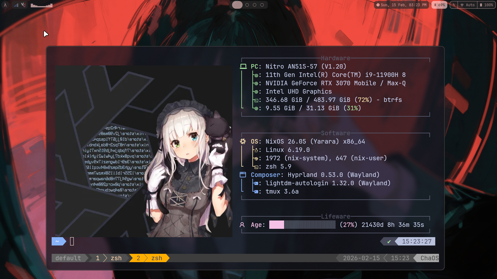

# nixos-config-public

My curent NixOS configuration

- Custom `kernelParams`, `kernel.sysctl`
- HomeManager and Flakes
- Hyprland Window Tiling Manager with Custom Waybar
- NVF (nvim)
- ODOH DNS solver via dnscrypt-proxy and iwd backend
- TLP, system76-scheduler, nbfc
- Permission Hardening
- Unstable Branch
- Btrfs file system

